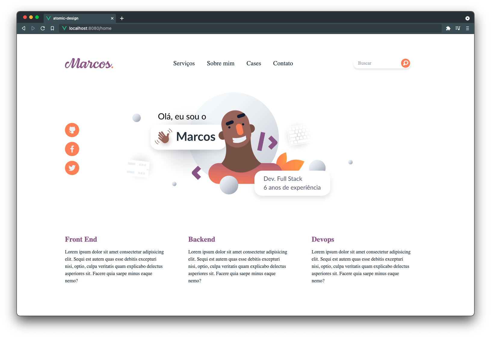

# Learning atomic-design
Simple project with Vue to learning the architecture Atomic Design architecture.



## Setup 🔥
After clone the repository

### Install dependencies
```
npm install
```

### Compiles and hot-reloads
```
npm run serve
```

### Compiles and minifies for production
```
npm run build
```

### Lints and fixes files
```
npm run lint
```

💡 See [Cataline Bootcamp](https://station.cataline.io/bootcamp) 
